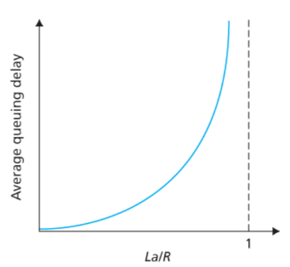

### Book C1 - Computer Networks and the Internet

<input type="date" value="2022-03-21" />

#### 1.1. What is the internet ?

##### A Nuts-and-Bolts Description

- Network of devices : end-systems / hosts
- Connected together by a network of communication links and packet switches
- Links are made of different types of physical media, including coaxial cable, copper wire, optical fiber, and radio spectrum
- **Packet Switch**: takes a packet arriving on one of its incoming communication links and forwards that packet on one of its outgoing communication links.
  - The two most prominent types in today’s Internet are routers and link-layer switches
  - Link-layer switches are typically used in access networks, while routers are typically used in the network core
- End systems access the Internet through Internet Service Providers (ISPs)
- Pieces of the Internet run protocols that control the sending and receiving of information.
  - The IP protocol specifies the format of the packets that are sent and received among routers and end systems
- It’s important that everyone agree on what each and every protocol does
- Internet ­standards are developed by the Internet Engineering Task Force
  (IETF)
- The IETF standards documents are called requests for comments (RFCs)

##### A Services Description

- Internet: an infrastructure that provides
  services to applications
- The applications are said to be **distributed applications**, since they involve multiple end systems that exchange data with each other
- End systems attached to the Internet provide a **socket interface** that specifies how a program running on one end system asks the Internet infrastructure to deliver data to a specific destination program running on another end system

##### What Is a Protocol?

- All activity in the Internet that involves two or more communicating remote entities is governed by a protocol
- A **protocol** defines the format and the order of messages exchanged between two or more communicating entities, as well as the actions taken on the transmission and/or receipt of a message or other event.

#### 1.2. The network edge

- Devices connected to the Internet are often referred to as end systems.
  > They are referred to as end systems because they sit at the edge of the Internet
- End systems are also referred to as hosts because they host (that is, run) application programs

##### Access Networks

- The network that physically connects an end system to the first router
- DSL (digital subscriber line)
  - Because the downstream and upstream rates are different, the access is said to be asymmetric
  - makes use of the telco’s existing local telephone infrastructure
- Cable internet access
  - requires special modems, called cable modems
  - it is a shared broadcast medium
    - every packet sent by the head end travels downstream on every link to every home and every packet sent by a home travels on the upstream channel to the head end
    - makes use of the cable television company’s existing cable television infrastructure
- Fiber to the home (FTTH)
- LAN
  - Although there are many types of LAN (local area network) technologies, Ethernet is by far the most prevalent
  - Wireless LAN access based on IEEE 802.11 technology, more colloquially known as WiFi,

##### Physical Media

- Twisted-Pair Copper Wire
- Coaxial Cable
- Fiber Optics
- Terrestrial Radio Channels
- Satellite Radio Channels

#### 1.3. The network core

##### Packet Switching

- end systems exchange messages with each other
- the source breaks long messages into smaller chunks of data known as **packets**.
- each packet travels through communication links and packet switches ( routers / link-layer switches )
- Packets are transmitted over
  each communication link at a rate equal to the full transmission rate of the link
  Most packet switches use **store-and-forward** transmission at the inputs to the links
  > the packet switch must receive the entire packet before it can begin to transmit the first bit of the packet onto the outbound link

###### Queuing Delays and Packet Loss

If an arriving packet needs to be transmitted onto a link but finds the link busy with the transmission of another packet, the arriving packet must wait in the output buffer

###### Forwarding Tables and Routing Protocols

In the Internet, every end system has an address called an IP address. When a source end system wants to send a packet to a destination end system, the source includes the destination’s IP address in the packet’s header

Each router has a forwarding table that maps destination addresses (or portions of the destination addresses) to that router’s outbound links. When a packet arrives at a router, the router examines the address and searches its forwarding table, using this destination address, to find the appropriate outbound link. The router then directs the packet to this outbound link

###### Circuit Switching

In circuit-switched networks, the resources needed along a path (buffers, link transmission rate) to provide for communication between the end systems are reserved for the duration of the communication
session between the end systems

##### A Network of Networks

- _Network Structure 1_ : interconnects all of the access ISPs with a single global transit ISP

- _Network Structure 2_ : consists of the hundreds of thousands of access ISPs and multiple global ­transit ISPs ( Tier 1 )

- _Network Structure 3_ : there may be a larger regional ISP (possibly spanning an entire country) to which the smaller regional ISPs in that region connect; the larger regional ISP then connects to a tier-1 ISP

- _Network Structure 4_ : a third-party company can create an Internet Exchange Point (IXP), which is a meeting point where multiple ISPs can peer together

- _Network Structure 5_ : adds content-provider networks ( attempts to “bypass” the upper tiers of the Internet by peering (settlement free) with lower-tier ISPs, either by directly connecting with
  them or by connecting with them at IXPs )

#### 1.4. Delay, Loss, and Throughput in Packet-Switched Networks

##### Types of Delay

- Processing Delay
- Queuing Delay
- Transmission Delay
- Propagation Delay

##### Queuing Delay and Packet Loss

###### Packet Loss

Because the queue capacity is finite, packet delays do not really approach infinity as the traffic intensity approaches 1.

Instead, a packet can arrive to find a full queue. With no place to store such a packet, a router will drop that packet; that is, the packet will be lost

##### Throughput in Computer Networks

In addition to delay and packet loss, another critical performance measure in computer networks is end- to-end throughput

To define throughput, consider transferring a large file from Host A to Host B across a computer network. This transfer might be, for example, a large video clip from one peer to another in a P2P file sharing system.

> The instantaneous throughput at any instant of time is the rate (in bits/sec) at which Host B is receiving the file. (Many applications, including many P2P file sharing ­systems, display the instantaneous throughput during downloads in the user interface—perhaps you have observed this before!) If the file consists of F bits and the transfer takes T seconds for Host B to receive all F bits, then the average throughput of the file transfer is F/T bits/sec

#### 1.5. Protocol Layers and Their Service Models

##### Layered Architecture

###### 5 Layered

- Application
  - where network applications and their application-layer protocols reside
  - An application-layer protocol is distributed over multiple end systems, with the application in one end system using the protocol to exchange packets of information with the application in another end system
  - We’ll refer to this packet of information at the application layer as a **message**
- Transport
  - transports application-layer messages between application endpoints
  - TCP and UDP
- Network
  - responsible for moving network-layer packets known as **datagrams** from one host to another
  - IP protocol
- Link
  - routes a datagram through a series of routers between the source and destination
  - Ethernet, WiFi
- Physical Layer
  - the job of the physical layer is to move the individual bits within the frame from one node to the next

###### OSI Model

Having discussed the Internet protocol stack in detail, we should mention that it is not the only protocol stack around. In particular, back in the late 1970s, the International Organization for Standardization (ISO) proposed that computer networks be organized around seven layers, called the Open Systems
Interconnection (OSI) model [ISO 2016]

#### 1.6 Networks Under Attack

The field of network security is about how the bad guys can attack computer networks and about how we, soon-to-be experts in computer networking, can defend networks against those attacks, or better yet, design new architectures that are immune to such attacks in the first place.
Given the frequency and variety of existing attacks as well as the threat of new and more destructive future attacks, network security has become a central topic in the field of computer networking. One of the features of this textbook is that it brings network security issues to the forefront.

#### 1.7 History of Computer Networking and the Internet

- The Development of Packet Switching: 1961–1972
- Proprietary Networks and Internetworking: 1972–1980
- A Proliferation of Networks: 1980–1990
- The Internet Explosion: The 1990s
