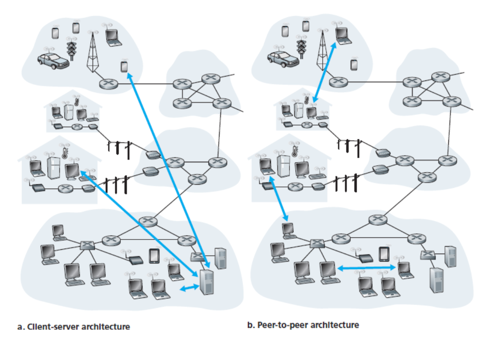

### Book C2 - Application Layer

<input type="date" value="2022-03-27" />

> Network applications are the raisons d’être of a computer network

#### 2.1 Principles of Network Applications

At the core of network application development is writing programs that run on different end systems and communicate with each other over the network

##### Network Application Architectures

From the application developer’s perspective, the network architecture is fixed and provides a specific set of **services** to applications

###### Client-Server Architecture

In a client-server architecture, there is an always-on host, called the **server**, which services requests from many other hosts, called **clients**

A single-server host is incapable of keeping up with all the requests from clients. For this reason, a **data center**, housing a large number of hosts, is often used to create a powerful virtual server

###### P2P Architecture

- there is minimal (or no) reliance on dedicated server
- the application exploits direct communication between pairs of intermittently connected hosts, called **peers**
- One of the most compelling features of P2P architectures is their **self-scalability**
- However, P2P applications face challenges of security, performance, and reliability due to their highly decentralized structure

##### Processes Communicating

It is not actually programs but **processes** that communicate

Processes on two different end systems communicate with each other by exchanging **messages** across the computer network

A **network application** consists of pairs of processes that send messages to each other over a network

> In the context of a communication session between a pair of processes, the process that initiates the communication (that is, initially contacts the other process at the beginning of the session) is labeled as the **client**. The process that waits to be contacted to begin the session is the **server**

###### The Interface Between the Process and the Computer Network

A process sends messages into, and receives messages from, the network through a software interface called a **socket**

A socket is the interface between the application layer and the transport layer within a host

It is also referred to as the Application **Programming Interface (API)** between the application and the network

###### Addressing Processes

To identify the receiving process, two pieces of information need to be specified:

1. the address of the host
2. an identifier that specifies the receiving process in the destination host.

In the Internet, the host is identified by its **IP address**.

##### Transport Services Available to Applications

- **Reliable Data Transfer**
  - guarantee that the data sent by one end of the application is delivered correctly and completely to the other end of the application
  - Packet loss might be acceptable for **loss-tolerant** applications may
- **Throughput**
  - available throughput, which, in the context of a communication session between two processes along a network path, is the rate at which the sending
  - the application could request a guaranteed throughput
    process can deliver bits to the receiving process
  - Applications that have throughput requirements are said to be **bandwidth-sensitive** applications
  - **Elastic** applications can make use of as much, or as little, throughput as happens to be available
- **Timing**
  - A transport-layer protocol can provide timing guarantees
    > An example guarantee might be that every bit that the sender pumps into the socket arrives at the receiver’s socket no more than 100 msec later
  - For non-real-time applications, lower delay is always preferable to higher delay, but no tight constraint is placed on the end-to-end delays
- **Security**
  - A transport protocol can provide security services like confidentiality, data integrity and end-point authentication
  - For example, in the sending host, a transport protocol can encrypt all data transmitted

##### Transport Services Provided by the Internet

- **TCP**

  - **_Connection-oriented_**
    - transport-layer control information is exchanged before the application-level messages begin to flow
      > to alert the client and server, allowing them to prepare
    - After the handshaking phase, a **TCP connection** is said to exist between the sockets
    - The connection is a full-duplex connection in that the two processes can send messages to each other over the connection at the same time.
  - **_Reliable data transfer_**
    - The communicating processes can rely on TCP to deliver all data sent without error and in the proper order
  - **_Congestion-control_**
    - a service for the general welfare of the Internet rather than for the direct benefit of the communicating processes.
    - throttles a sending process (client or server) when the network is congested between sender and receiver

  > **Secure Sockets Layer (SSL)** : TCP-_enhanced_-with-SSL not only does everything that traditional TCP does but also provides critical process-to-process **security** services, including encryption, data integrity, and end-point authentication

- **UDP**
  > no-frills, lightweight transport protocol, providing minimal services.
  - **_connectionless_** : there is no handshaking before the two processes start to communicate.
  - **_unreliable_** data transfer service : no guarantee that the message will ever reach the receiving process. messages that do arrive at the receiving process may arrive out of order
  - does not include a congestion-control mechanism

###### Services Not Provided by Internet Transport Protocols

today’s Internet can often
provide satisfactory service to time-sensitive applications, but it cannot provide any timing or throughput guarantees

##### Application-Layer Protocols

An application-layer protocol defines how an application’s processes, running on different end systems, pass messages to each other

- The **types** of messages exchanged, for example, request messages and response messages
- The **syntax** of the various message types, such as the fields in the message and how the fields are delineated
- The **semantics** of the fields, that is, the meaning of the information in the fields
- **Rules** for determining when and how a process sends messages and responds to messages

> Some application-layer protocols are specified in RFCs and are therefore in the public domain (eg. HTTP)

An application-layer protocol is only one piece of a network application

#### 2.2 The Web and HTTP

the Web operates on demand.
everyone can become a publisher at extremely low cost.

##### Overview of HTTP

HTTP is implemented in two programs: a **client** program and a **server** program

A Web page (also called a document) consists of **objects**.
An object is simply a file that is addressable by a single URL

**Web servers**, which implement the server side of HTTP, house Web objects

HTTP uses **TCP** as its underlying transport protocol

Because an HTTP server maintains no information about the clients, HTTP is said to be a **stateless** protocol

##### Non-Persistent and Persistent Connections

In many Internet applications, the client and server communicate for an extended period of time.

should each request/response pair be sent over a separate TCP connection or the same one ?
the former approach, the application is said to use **non-persistent** connections; and in the latter approach, **persistent connections**

HTTP uses persistent connections in its default mode

most browsers open 5 to 10 parallel TCP connections, the use of parallel connections shortens the response time

##### HTTP Message Format

- HTTP Request Message: method, url, version, headers, body
- HTTP Response Message: version, status code, reason phrase, headers, body

##### User-Server Interaction: Cookies

HTTP server is stateless, cookies allow sites to keep track of users.

> components: (1) a cookie header line in the HTTP response message; (2) a cookie header line in the HTTP request message; (3) a cookie file kept on the user’s end system and managed by the user’s browser; and (4) a back-end database at the Web site

cookies can be used to identify a user and can thus be used to create a user session layer on top of stateless HTTP.

##### Web Caching

A Web cache—also called a proxy server—is a network entity that satisfies HTTP requests on the behalf of an origin Web server

Typically a Web cache is purchased and installed by an ISP.

It can substantially reduce the response time for a client request and reduce traffic on an institution’s access link to the Internet.

Through the use of Content Distribution Networks (CDNs), Web caches are increasingly playing an important role in the Internet

###### The Conditional GET

the copy of an object residing in the cache may be stale

HTTP GET includes an If-Modified-Since: header line
which can receive 304 Not Modified in the status line

#### 2.3 Electronic Mail in the Internet

#### 2.4 DNS—The Internet’s Directory Service

#### 2.5 Peer-to-Peer File Distribution

#### 2.6 Video Streaming and Content Distribution Networks

#### 2.7 Socket Programming: Creating Network Applications
