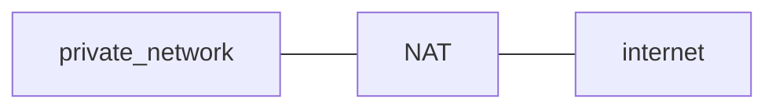

### Class 6

<input type="date" value="2022-04-12" />

Network Layer - Data Plane

#### Classless routing ( Subnets )

##### Host

- @IP
- Subnet Mask -> Depends on the environment
- Default Gateway
- DNS/s

> Sub-netting: Después en la practica

##### Masks

The mask is only the the LAN, is always local

##### Communication

When sending a message to another subnet, we send to the default gateway

- To check if a host is in the same network the mask os applied to its @IP & that's compared to the subnet address

##### Routing

###### Host (?)

| destination network |      next jump      |
| :-----------------: | :-----------------: |
| {this_subnet}.{dir} |      LAN.{dir}      |
|   Default Gateway   | {this_subnet}.{dir} |

###### Router (eg.)

| destination network | next jump  |
| :-----------------: | :--------: |
|   157.92.49.49/24   |   port 1   |
|   157.92.49.50/24   |   port 2   |
|   157.92.49.51/24   |   port 3   |
|   157.92.49.52/24   |   port 4   |
|    157.92.1.4/30    |   port 5   |
|      0.0.0.0/0      | 157.92.1.6 |

- 0.0.0.0/0 -> Default
- Check masks from bigger to smaller

##### Forwarding

- The router caches result with a hash so it does not need to route every time ( this is possible now that memory is cheap )
- When the routing table changes the cache may be dropped ( depends on policy, but it needs to be sanitized )

#### DHCP ( Dynamic Host Configuration Protocol )

```
                Server          Client          Server
            (not selected)                    (selected)

                  v               v               v
                  |               |               |
                  |     Begins initialization     |
                  |               |               |
                  | _____________/|\____________  |
                  |/DHCPDISCOVER | DHCPDISCOVER  \|
                  |               |               |
              Determines          |          Determines
             configuration        |         configuration
                  |               |               |
                  |\             |  ____________/ |
                  | \________    | /DHCPOFFER     |
                  | DHCPOFFER\   |/               |
                  |           \  |                |
                  |       Collects replies        |
                  |             \|                |
                  |     Selects configuration     |
                  |               |               |
                  | _____________/|\____________  |
                  |/ DHCPREQUEST  |  DHCPREQUEST\ |
                  |               |               |
                  |               |     Commits configuration
                  |               |               |
                  |               | _____________/|
                  |               |/ DHCPACK      |
                  |               |               |
                  |    Initialization complete    |
                  |               |               |
                  .               .               .
                  .               .               .
                  |               |               |
                  |      Graceful shutdown        |
                  |               |               |
                  |               |\ ____________ |
                  |               | DHCPRELEASE  \|
                  |               |               |
                  |               |        Discards lease
                  |               |               |
                  v               v               v
     Figure 3: Timeline diagram of messages exchanged between DHCP
               client and servers when allocating a new network address
```

- Exclusive to IPv4

##### NAT ( Network Address Translation )



- It's a **middlebox**
- maps hosts in the local network with ports of the NAT

##### Other Middle Boxes

- Firewall ( Protects ports )
- IDS (Instruction Detection System) -> Deep Packet Inspection
- Load Balancer

#### IPv6

##### Header

```
   +-+-+-+-+-+-+-+-+-+-+-+-+-+-+-+-+-+-+-+-+-+-+-+-+-+-+-+-+-+-+-+-+
   |Version| Traffic Class |           Flow Label                  |
   +-+-+-+-+-+-+-+-+-+-+-+-+-+-+-+-+-+-+-+-+-+-+-+-+-+-+-+-+-+-+-+-+
   |         Payload Length        |  Next Header  |   Hop Limit   |
   +-+-+-+-+-+-+-+-+-+-+-+-+-+-+-+-+-+-+-+-+-+-+-+-+-+-+-+-+-+-+-+-+
   |                                                               |
   +                                                               +
   |                                                               |
   +                         Source Address                        +
   |                                                               |
   +                                                               +
   |                                                               |
   +-+-+-+-+-+-+-+-+-+-+-+-+-+-+-+-+-+-+-+-+-+-+-+-+-+-+-+-+-+-+-+-+
   |                                                               |
   +                                                               +
   |                                                               |
   +                      Destination Address                      +
   |                                                               |
   +                                                               +
   |                                                               |
   +-+-+-+-+-+-+-+-+-+-+-+-+-+-+-+-+-+-+-+-+-+-+-+-+-+-+-+-+-+-+-+-+
```

- **Version**: `✓` [4-bit] Internet Protocol version number = 6.
- **Traffic Class**: `✗` [8-bit] traffic class field. See section 7.
- **Flow Label**: `✗` [20-bit] flow label. See section 6 of RFC.
- **Payload Length**: `✓` [16-bit] unsigned integer. Length of the IPv6
  - payload, i.e., the rest of the packet following this IPv6 header, in octets.
  - Note that any extension headers [section 4] present are considered part of the payload, i.e., included in the length count.
- **Next Header**: `~✗` [8-bit] selector. Identifies the type of header immediately following the IPv6 header. Uses the same values as the IPv4 Protocol field [RFC-1700 et seq.].
- **Hop Limit**: `✓` [8-bit] unsigned integer. Decremented by 1 by each node that forwards the packet. The packet is discarded if Hop Limit is decremented to zero.
- **Source Address**: `✓` [128-bit] address of the originator of the packet. See [ADDRARCH].
- **Destination Address**: `✓` [128-bit] address of the intended recipient of the packet (possibly not the ultimate recipient, if a Routing header is present). See [ADDRARCH] and section 4.4.

##### Features

- Bigger direction space `✓`
- Modular Header `✗`
- No Fragmentation in network ( has to be done at ends ) `✓`
- Auto configuration `~`
- Differential Flow Treatment ( For QoS ) `✗`
- No checksum ( There are few errors & integrity is checked in adjacent layers ) `~`

#### SND ( Software Defined Networks )

The first routers ran their routing protocol ( generating routing table )

SDN's central idea is to separate the control-plane from the data-plane

control-plane: constructs the routing table in a centralized ( & maybe distributed ) manner

very important on a large plane, when there are a lot of actors and continuos changes

##### Openflow Standard

SDN can take decisions based on many things

- TCP/UDP `src/dst` port
- @IP `src/dst`

#### Notes

- patch over patch
- video / bibliography in campus . Some RFC . Only for final exam
